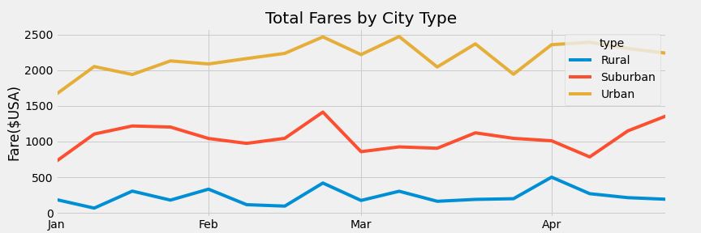

# Ride Share Analysis: City type breakdown
 
## Introduction
The purpose of this ride share analysis is to help us understand the statistics based on the types of cities that the rides took place in. This should help us give the CEO better insight into how they can best adjust their business practices.
 
## Results
Here are the results that we were able to conclude:
 
### Rideshare Data by City Type
 * Rural
    > Total Rides = 125
    > Total Drivers = 78
     - Average # of rides per Driver = 1.6
    > Total Fares = $4327.93
    > Average Fare per Ride = $34.62
    > Average Fare Per Driver = $55.49
 * Suburban
    > Total Rides = 625
    > Total Drivers = 490
     - Average # of rides per Driver = 1.27
    > Total Fares = $19,356.33
    > Average Fare per Ride = $30.97
    > Average Fare Per Driver = $39.50
 * Urban
    > Total Rides = 1625
    > Total Drivers = 2405
     - Average # of rides per Driver = .67
    > Total Fares = $39,854.38
    > Average Fare per Ride = $24.53
    > Average Fare Per Driver = $16.57
 
### Rideshare Fare data over time

 
## Summary
Looking at the data there are a few things we can conclude. First of all, Some drivers do not have a ride to their name in urban areas, it may be a good idea to reduce the amount of drivers in that city type. On the other hand, Late Feb saw a spike in overall income made, in all three city types. I would recommend looking into the marketing programs that were launched during that time or doing a deep dive into what caused the surge as a possible marketing plan. It also seems to show that there are more fluctuations in rides in urban areas throughout a given time period compared to rural and suburban areas, this might show that there are more consistent riders in the suburbs as urban riders fluctuate which lets us know we should try to create more retention programs in urban areas.

